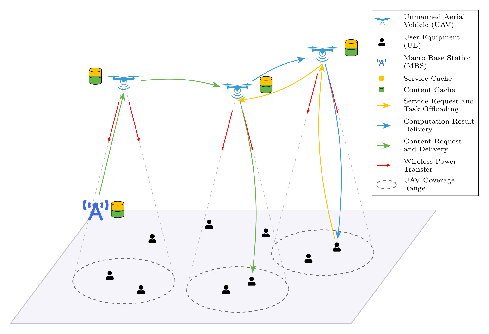

# Multi-UAV Assisted Wireless Powered Mobile Edge Computing: A Hybrid Optimization Approach

## Objective

The primary objective of this research is to develop a framework for a **multi-UAV-assisted collaborative Mobile Edge Computing (MEC)** network. We aim to jointly optimize the interdependent components: **task offloading decisions, service caching placement, content caching strategies, UAV trajectories and wireless power transfer**. The goal is to minimize service latency, system-wide energy consumption, device offline rate while simultaneously maximizing user fairness.

We are aiming to implement a hybrid optimization approach that combines multi-agent deep reinforcement learning with collaborative and adaptive caching policies. We are trying to create a generic framework that can be used with different models for finding the best-suited one for our purpose. We are also exploring incorporating **attention mechanisms** within the multi-agent reinforcement learning models for scalability and improved performance.

Also trying to incorporate modern Python practices and type annotations. Developed using `Python 3.12.0` and `PyTorch 2.8.0`.

## 🎯 What This Project Does

This system optimizes a network of unmanned aerial vehicles (UAVs) that serve mobile user devices by:

- **Reducing latency**: Smart task distribution between devices and edge servers
- **Minimizing energy**: Efficient UAV movement and computation scheduling  
- **Managing battery life**: Wireless power transfer (WPT) to critical devices
- **Ensuring fairness**: Equal service quality for all users
- **Learning intelligently**: Multi-agent reinforcement learning that adapts in real-time

Perfect for scenarios like disaster response, smart cities, IoT networks, and remote area connectivity.

## 📚 Understanding the System

### What's Included

**8 MARL Algorithm Variants:**
- **MADDPG** - Stable baseline for multi-agent learning
- **MATD3** - Improved MADDPG with delayed updates
- **MAPPO** - On-policy algorithm for faster convergence
- **MASAC** - Entropy-regularized learning for exploration
- **4 Attention Variants** - Graph Attention Networks for better agent coordination

See [marl_models/README.md](marl_models/README.md) for algorithm details.

**Advanced Features:**
- ✅ Offline rate tracking - Monitors device battery health
- ✅ Wireless Power Transfer - UAVs charge critical devices
- ✅ Smart caching - Adaptive content placement
- ✅ Multi-agent coordination - Through attention mechanisms
- ✅ 3-stage tuning - Optimize reward weights, agent params, architecture



## 📁 Project Structure

```
.
├── environment/                 # Simulation
│   ├── env.py                   # Main simulation loop
│   ├── uavs.py                  # UAV dynamics
│   ├── user_equipments.py       # Device battery & requests
│   └── comm_model.py            # Communication & WPT
│
├── marl_models/                 # RL algorithms (see marl_models/README.md)
│   ├── maddpg/, ...             # Base algorithms
│   ├── attention_maddpg/, ...   # Attention variants
│   └── random_baseline/         # Baseline for comparison
│
├── utils/                       # Utilities
│   ├── logger.py                # Training logs & metrics
│   ├── plot_logs.py             # Single run visualization
│   └── comparative_plots.py     # Multi-algorithm comparison
│
├── config.py                   # All parameters (detailed in change_parameters.md)
├── train.py                    # Training script
├── test.py                     # Testing script
├── tune.py                     # Hyperparameter tuning with Optuna
└── main.py                     # Legacy interface
```

## ⚡ Quick Start (5 minutes)

### 1. Setup
```bash
# Clone repository
git clone <repo_url>
cd Multi-UAV-Mobile-Edge-Computing-Hybrid-Optimization

# Create virtual environment (Python 3.12+)
python -m venv venv
venv\Scripts\activate  # Windows
# or: source venv/bin/activate  # Linux/Mac

# Install dependencies
pip install -r requirements.txt
```

### 2. Train Your First Model
```bash
# Train MADDPG for 1000 episodes
python train.py --model maddpg --episodes 1000

# Watch training progress in console
# Results saved to train_logs/maddpg/
```

That's it! You now have a working multi-agent learning system. ✅

## 🚀 How to Use


### 📋 Requirements

- **Python**: 3.12.0+
- **PyTorch**: 2.8.0+
- **NumPy**, **Matplotlib**, **Optuna** (for tuning)

```bash
# Install all dependencies
pip install -r requirements.txt
```

### Training

It can be used to start training from scratch or resume training from a previously saved checkpoint.

```bash
# Start training from scratch
python main.py train --num_episodes=<total_episodes>

# To resume training from a saved checkpoint, specify no. of additional episodes, path to the saved checkpoint, and path to the saved config file (to load and use the same settings).
python main.py train --num_episodes=<additional_episodes> --resume_path="<path_to_checkpoint_directory>" --config_path="<path_to_saved_config>"

```

Results saved to: `train_logs/<model>/<timestamp>/`

### Hyperparameter Tuning

Optimize reward weights and agent parameters with **3-stage tuning**:

```bash
# Stage 1: Optimize reward weights (ALPHA_1, ALPHA_2, ALPHA_3, ALPHA_4): helps understand reward trade-offs
python tune.py --stage 1 --episodes 500 --trials 50

# Stage 2: Optimize learning rates, batch sizes, network architecture: find best agent hyperparameters
python tune.py --stage 2 --episodes 1000 --trials 50

# Stage 3: Optimize attention architecture (attention models only): tune ATTN_HIDDEN_DIM and ATTN_NUM_HEADS
python tune.py --stage 3 --episodes 500 --trials 30
```

### Testing

It can be used to test a saved model for a specified number of episodes.
To test a saved model, you must provide the path to the model's directory and its corresponding configuration file.

```bash
# Start testing, with saved model path and config file saved during that model's training run (to load and use the same settings).
python main.py test --num_episodes=<total_episodes> --model_path="<path_to_model_directory>" --config_path="<path_to_saved_config>"
```

### Visualization

```bash
# Compare multiple algorithms
python utils/compare_algorithms.py \
    --logs train_logs/maddpg_run train_logs/matd3_run train_logs/mappo_run \
    --names MADDPG MATD3 MAPPO \
    --output comparison_plots \
    --smoothing 10
```

Refer [Plotting Module](./docs/PLOTTING_MODULE.md) for detailed plotting plan.

## 🚀 Status

**PS: Currently under rapid development and may be subject to significant changes.**

## 👨‍💻 Contributors

- Roopam Taneja
- Vraj Tamakuwala

### Made with ❤️
